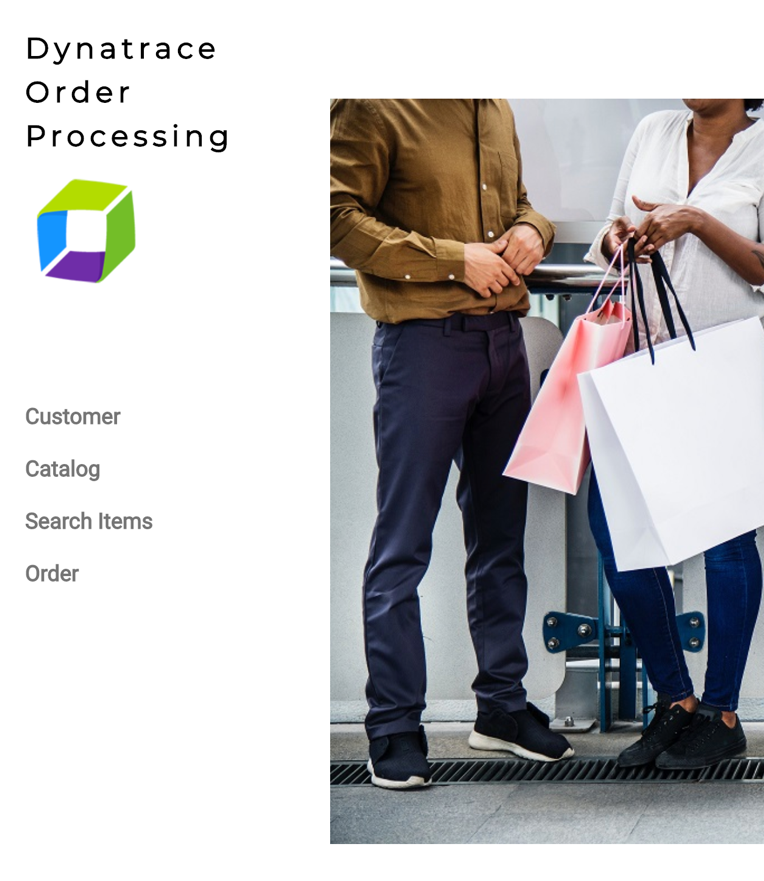
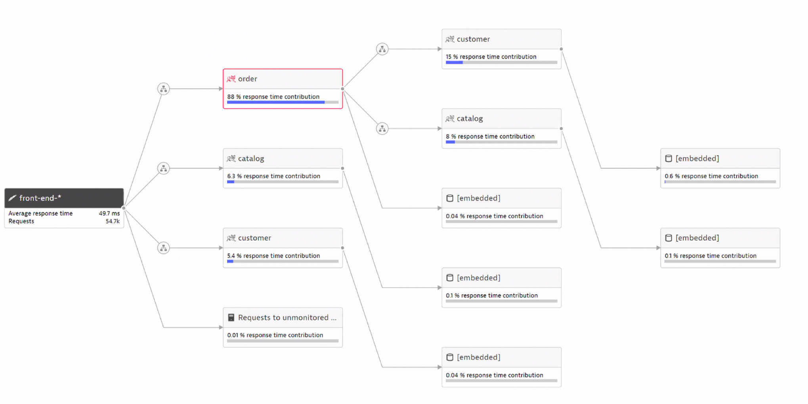
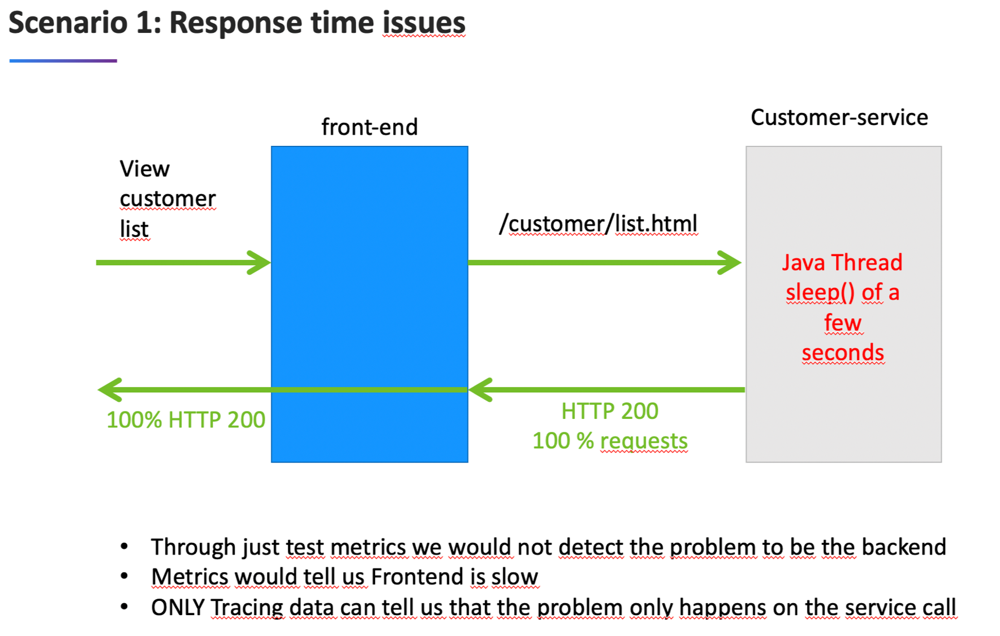
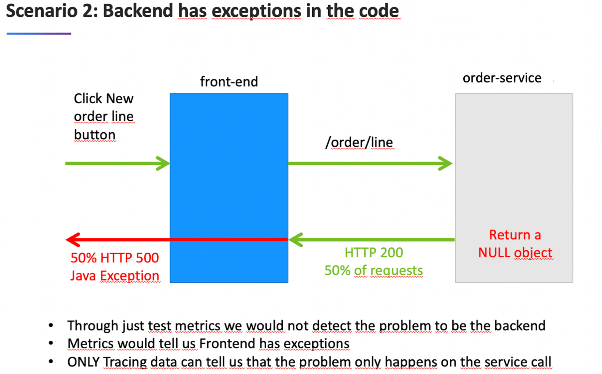
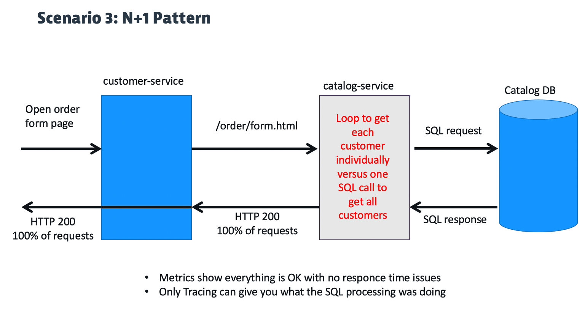

# Overview

This application was built for demonstations of Dynatrace.  The front-end look like this.



The overall application is made up of four Docker components: a frontend web UI and 3 backend services.  Once monitored by Dynatrace, a multi-tier call flow will be available such as shown below.



# Pre-built Docker Images

The dt-orders application has pre-built problems programmed within different versions.  See source in the [dt-orders repo](https://github.com/dt-orders).  Each version for each service, has pre-built docker images that are published to [dockerhub](https://hub.docker.com/u/dtdemos).

This is a summary of the versions followed by a description of the problem scenarios.

| Service  | Branch/Docker Tag | Description |
|---|:---:|---|
| frontend | 1 | Normal behavior |
| catalog-service | 1 | Normal behavior |
| customer-service | 1 | Normal behavior |
| order-service | 1 | Normal behavior |
| customer-service | 2 | High Response time for /customer/list.html |
| order-service | 2 | 50% exception for /order/line URL and n+1 back-end calls for /order/form.html |
| customer-service | 3 | Normal behavior |
| order-service | 3 | Normal behavior |

# Problem Scenarios

## Deploy dtdemos/customer-service:2



## Deploy dtdemos/order-service:2 

Both these scenearios are enabled



and...



# Deployment

Below are two option to deploy the application:
* Using docker-compose.
* Using Kubernetes

## docker-compose

This will setup the application using docker-compose.

1 . Have a host with [Docker](https://docs.docker.com/get-docker/) and [docker-compose](https://docs.docker.com/compose/install/) installed on it

2 . Clone this repo 

3 . Start the application

You can adjust the `docker-compose.yaml` for alternate ports and images names to meet your needs. But, you can just run `docker-compose up` to start all the services.  It takes about 45 seconds to start, but then the application can be accessed

```
docker-compose up -d
```

4 . Check that frontend and service containers are running

```
docker-compose ps
```

5 . Open the front-end in a browser for the app `http://localhost`

6 . Stop the application

```
docker-compose down
```

7 . To change image versions, just edit the `docker-compose.yaml` and run `docker-compose up` again.

## Kubernetes

1 . Create a Kubernetes cluster and configure kubectl to connect to it. 

2 . Have a Dynatrace tenant and install [Dynatrace OneAgent Operator](https://www.dynatrace.com/support/help/technology-support/cloud-platforms/kubernetes/deploy-oneagent-k8/)  

3 . Clone this repo and run these commands
```
kubectl create ns dt-orders

# apply app chart files
kubectl -n dt-orders apply -R -f .

# apply just one for example:
kubectl -n dt-orders apply front-end.yaml
```

4 . Monitor pods.  You should see this:
```
kubectl -n dt-orders get pods
NAME                        READY   STATUS    RESTARTS   AGE
catalog-9bd57f66c-zw445     1/1     Running   0          6m48s
customer-7bd5687fd7-mlr2d   1/1     Running   0          6m48s
frontend-8699dd574f-vcwzn   1/1     Running   0          6m47s
order-657b698d96-vhw5m      1/1     Running   0          6m47s
```

5 . Monitor services.  This is example from AWS EKS
```
kubectl -n dt-orders get svc
NAME       TYPE           CLUSTER-IP       EXTERNAL-IP                       PORT(S)          AGE
catalog    NodePort       10.100.27.48     <none>                            8080:30092/TCP   43m
customer   NodePort       10.100.132.224   <none>                            8080:31785/TCP   38m
frontend   LoadBalancer   10.100.247.102   xxx.eu-west-3.elb.amazonaws.com   80:30879/TCP     51m
order      NodePort       10.100.104.247   <none>                            8080:32667/TCP   38m
```

6 . Get the external URL for the frontend

This may vary by the k8 installation you setup

```
# Hostname
echo http://$(echo http://$(kubectl -n dt-orders get service frontend -o jsonpath="{.status.loadBalancer.ingress[0].hostname}")

# IP
echo http://$(echo http://$(kubectl -n dt-orders get service frontend -o jsonpath="{.status.loadBalancer.ingress[0].ip")
```

7 . Open the frontend URL in a browser

8 . To change image versions, just edit the service `yaml` file and run `kubectl -n dt-orders apply <SERVICE YAML FILE>` and the monitor the new pod being created.
