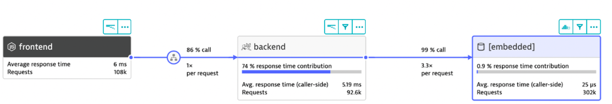

# Overview

This application was built for demonstations of Dynatrace.  The front-end look like this.

There are two topologies of the application
1. **Monolith** - two Docker components: a frontend web UI and 1 backend services.  Once monitored by Dynatrace, a multi-tier call flow will be available such as shown below.

    

1. **Multi-services** - four Docker components: a frontend web UI and 3 backend services.  Once monitored by Dynatrace, a multi-tier call flow will be available such as shown below.

    

# How to run the application

Below are two options to deploy the application:
* Using docker-compose. See the docker-compose sub-folder [README](docker-compose/README.md)
* Using kubernetes. See the K8 sub-folder [README](k8/README.md)

# Traffic generators

Once the application is running, the Docker images from these two repos can be used to create traffic against the running application:

* [Browser traffic](https://github.com/dt-orders/browser-traffic)
* [Load traffic](https://github.com/dt-orders/load-traffic)

# Problem Patterns

The dt-orders application has pre-built problems programmed within different versions that can be enabled as using a GET request to a setversion URL. 

Pre-built docker images are also published to [dockerhub](https://hub.docker.com/u/dtdemos) with the problem patterns ON or OFF if that approach of deploying a new container is desired.  The version is set as a Docker tag, for example: `dtdemos/customer-service:2.0.0` is the customer service version 2.

# Monolith App versions

| Service  | Version | Description |
|---|:---:|---|
| frontend | 1 | Normal behavior |
| backend | 1 | Normal behavior |
| backend | 2 | High Response time for all requests |
| backend | 3 | 50% exception (http 500) for all requests |

# Multi-services versions

| Service  | Version | Description |
|---|:---:|---|
| frontend | 1 | Normal behavior |
| catalog-service | 1 | Normal behavior |
| customer-service | 1 | Normal behavior |
| customer-service | 2 | High Response time for view customer list only (/customer/list.html) |
| customer-service | 3 | High Response time for all requests |
| order-service | 1 | Normal behavior |
| order-service | 2 | 50% exception (http 500) for new order line only (/order/line URL)  |
| order-service | 3 | 50% exception (http 500) for all requests |
| order-service | 4 | n+1 back-end calls for view order form only (/order/form.html) |

# Microservices - Pictures

View the **Images Powerpoint** in the `images` subfolder for pictures of these problems.

# Set version while app is running

Use the version URLs below to view and set the version. The services read the provided or default environment variable and then maintain this as an internal variable that can be updated. You can use the URLs below in a browser or just make a GET request to the URL using a tool like curl.

 What | URL | Description |
|---|---|---|
| View current version | http://[hostname or IP]/[service name]/version | Will just display a number |
| Set version | http://[hostname or IP]/[service name]/setversion/X | X = value like 1 or 2 |

Notes
* [service name] is a value such as `order`, `customer`, `backend`
* After setting the version - the response message will say `Action was successful!`.  
* Also, the version number on the DT Orders home page will reflect the new version.

# Pre-built Docker Images

There is a `buildpush.sh` script in [customer service](https://github.com/dt-orders/customer-service/blob/master/buildpush.sh) and [order service](https://github.com/dt-orders/order-service/blob/master/buildpush.sh) repos that will just set an ENVIRONMENT that will run the services with that version. 

The version number on the DT Orders home page will reflect the service version.

The version can still be changed using the `Feature Flag` mentioned above.
