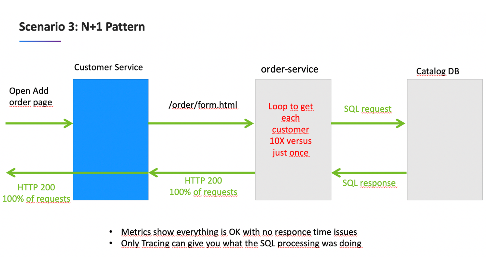

# Overview

This application was built for demonstations of Dynatrace.  The front-end look like this.

There are two toplogies of the application
1. **monolith** - two Docker components: a frontend web UI and 1 backend services.  Once monitored by Dynatrace, a multi-tier call flow will be available such as shown below.

    

1. **microservices** - four Docker components: a frontend web UI and 3 backend services.  Once monitored by Dynatrace, a multi-tier call flow will be available such as shown below.

    

# Traffic generators

Once the application is running, the Docker images from these two repos can be used to create traffic against the running application:

* [Browser traffic](https://github.com/dt-orders/browser-traffic)
* [Load traffic](https://github.com/dt-orders/load-traffic)

# Deployment

Below are two option to deploy the application:
* See [docker-compose sub-folder README](docker-compose/README.md)
* See [K8 sub-folder README](k8/README.md)

# Pre-built Docker Images

The dt-orders application has pre-built problems programmed within different versions.  See source in the [dt-orders repo](https://github.com/dt-orders).  Each version for each service, has pre-built docker images that are published to [dockerhub](https://hub.docker.com/u/dtdemos).

# Monolith images

This is a summary of the versions followed by a description of the problem scenarios.

| Service  | Branch/Docker Tag | Description |
|---|:---:|---|
| frontend | 1 | Normal behavior |
| backend-service | 1 | Normal behavior |

# Microservices images

This is a summary of the versions followed by a description of the problem scenarios.

| Service  | Branch/Docker Tag | Description |
|---|:---:|---|
| frontend | 1 | Normal behavior |
| catalog-service | 1 | Normal behavior |
| customer-service | 1 | Normal behavior |
| order-service | 1 | Normal behavior |
| customer-service | 2 | High Response time for /customer/list.html |
| order-service | 2 | 50% exception for /order/line URL and n+1 back-end calls for /order/form.html |
| customer-service | 3 | Normal behavior |
| order-service | 3 | Normal behavior |

# Microservices - Problem Scenarios

## Deploy dtdemos/customer-service:2

## Deploy dtdemos/order-service:2 

Both these scenearios are enabled

and...

